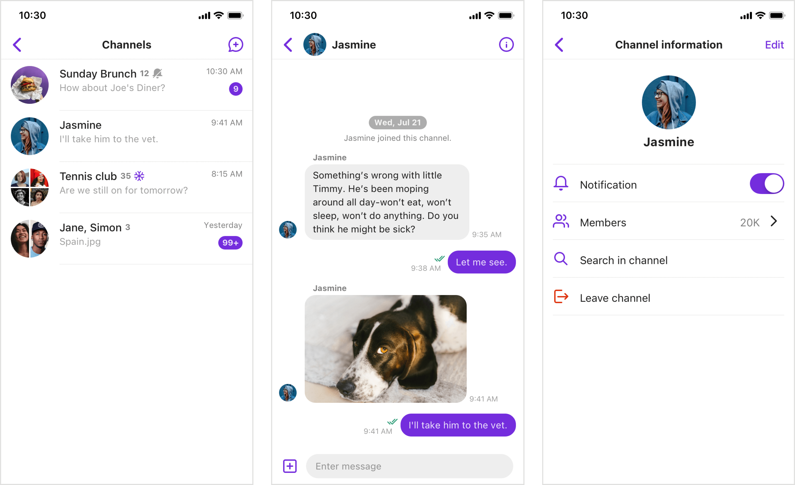
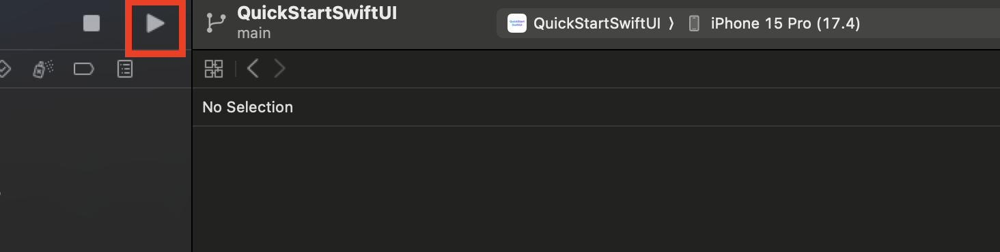
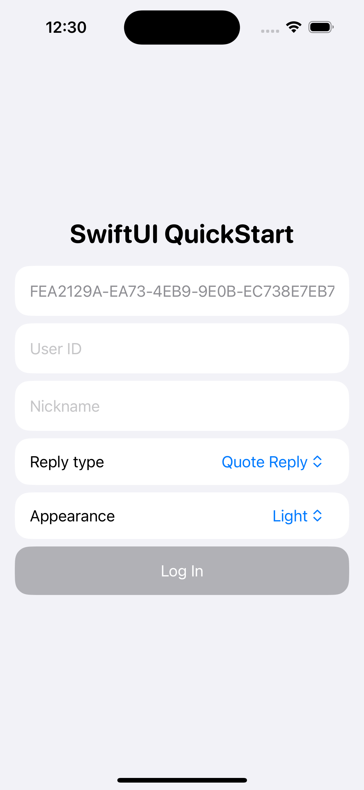

# Sendbird Chat SwiftUI Sample
Sendbird Chat SwiftUI is a development kit with a declarative user interface, enabling easy and fast integration of standard chat features into new or existing client apps. This repository contains a sample app demonstrating the use of Sendbird Chat SwiftUI.
Learn more about Sendbird Chat SwiftUI in the [documentation](https://sendbird.com/docs/chat/uikit/v3/swiftui/overview). For assistance or questions, visit [our community](https://community.sendbird.com).

## Screenshots


## How to Use the Sample App

### 1. Clone the Repository

```bash
git clone git@github.com:sendbird/sendbird-swiftui-ios.git
```

### 2. Open in Xcode

Navigate to the sendbird-swiftui-ios/Sample directory and open it in Xcode. Make sure to open the sendbird-swiftui-ios/Sample/Sample.xcodeproj file.

### 3. Run the Sample App
Run the sample app on your simulator or device.



### 4. Test with Your Data


For user ID and nickname, you can enter any values you like. The app will run in guest mode.

> Note: Avoid using guest mode in production.

## Customize with Your Data

To tailor the sample app to your needs, replace the default app ID with your own. You can obtain this by [creating a Sendbird application from the dashboard](https://dashboard.sendbird.com). You can also add your own data on the dashboard to test, allowing you to experience the app with data from your Sendbird application.